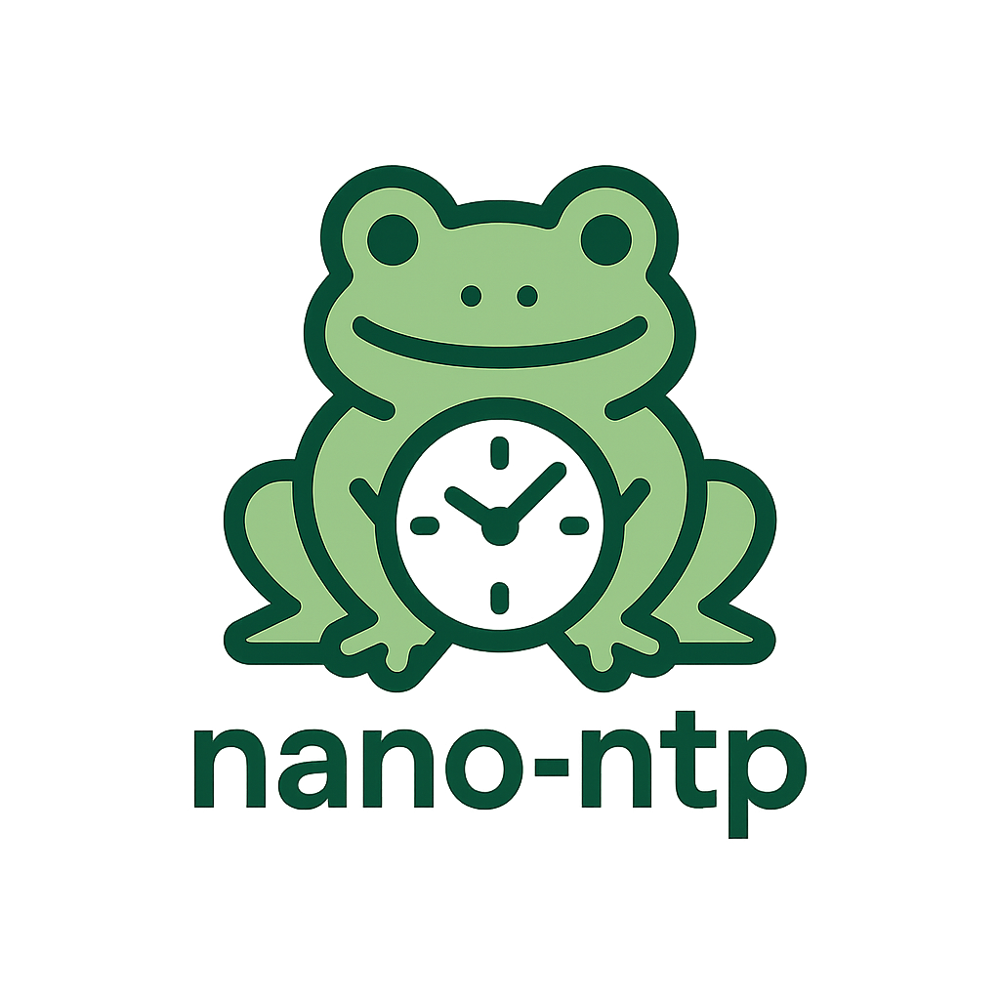

# nano-ntp — Minimal SNTP Client in Flat Assembly



**nano-ntp** is a minimal SNTP client written in pure x86_64 assembly.  
The binary is less than 1 KB and synchronizes Linux system time using Google and Cloudflare NTP servers.

---

## Clone & Build

```bash
git clone https://github.com/victormeloasm/nntp.git
cd nntp
fasm nntp.asm
````

This will generate the `nntp` binary in the current directory.

---

## Usage

Make the binary executable:

```bash
chmod +x ./nntp
```

Synchronize the system clock:

```bash
sudo ./nntp
```

Alternatively, grant the capability to run without `sudo`:

```bash
sudo setcap cap_sys_time=+ep ./nntp
./nntp
```

Check the new system time:

```bash
date
```
## Download

You can download the latest prebuilt binary here:

[**⬇️ Download nano-ntp v1.0 (ZIP)**](https://github.com/victormeloasm/nntp/releases/download/v1.0/nntp.zip)

---

## Project Structure

```
nntp/
├── nntp.asm       # source code (x86_64 assembly)
├── src/logo.png   # project logo
└── README.md
```

```
Víctor Duarte Melo - 2025 
```
